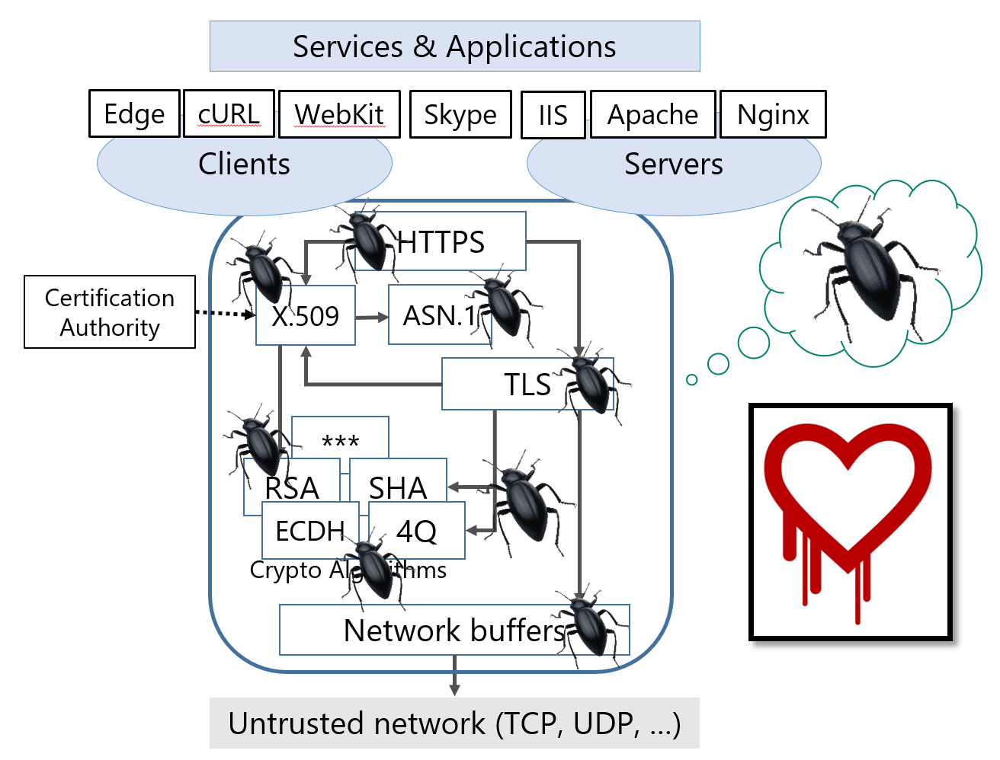
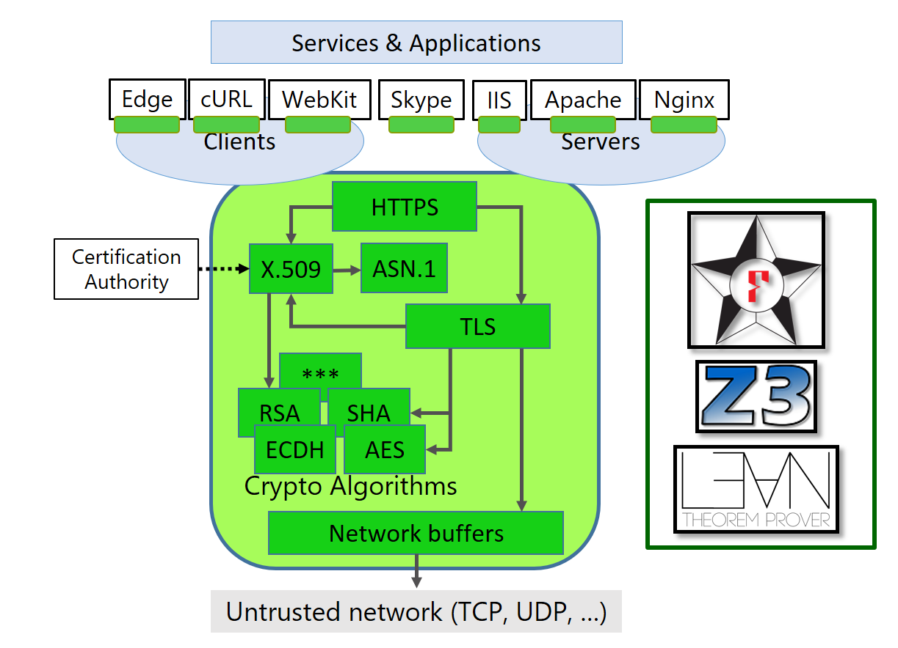

{:class="img-logo"}
{:class="img-logo"}
{:class="img-logo"}
{:class="img-logo"}

> `Project Everest aims to build and deploy a verified HTTPS stack`

We are a [team of researchers and
engineers](https://project-everest.github.io/people/) from several
organizations, including [Microsoft
Research](https://www.microsoft.com/en-us/research/project/project-everest-verified-secure-implementations-https-ecosystem/),
[Carnegie Mellon University](http://www.andrew.cmu.edu/user/bparno/),
[INRIA](http://prosecco.gforge.inria.fr/), and the
[MSR-INRIA](https://www.inria.fr/en/institute/partnerships/industrial-partnerships2/microsoft-research)
joint center.

Everest is a recursive acronym: It stands for the "Everest VERified
End-to-end Secure Transport".

### The HTTPS Ecosystem

The HTTPS ecosystem (HTTPS and TLS protocols, X.509 public key
infrastructure, crypto algorithms) is the foundation on which Internet
security is built. Unfortunately, this ecosystem is brittle, with
headline-grabbing attacks such as FREAK and LogJam
[http://mitls.org/pages/attacks/](http://mitls.org/pages/attacks/) and
emergency patches many times a year.

Project Everest addresses this problem by constructing a
high-performance, standards-compliant, formally verified implementation of
components in HTTPS ecosystem, including
[TLS](https://tools.ietf.org/html/draft-ietf-tls-tls13-21), the main
protocol at the heart of HTTPS, as well as the main underlying
cryptographic algorithms such as AES, SHA2 or X25519.

At the TLS level, for instance, we are developing new implementations
of existing and forthcoming protocol standards and formally proving,
by reduction to cryptographic assumptions on their core algorithms,
that our implementations provide a secure-channel abstraction between
the communicating endpoints. Implementations of the core algorithms
themselves are also verified, producing performant portable C code or
highly optimized assembly language.

We aim for our verified components to be drop-in replacements suitable
for use in mainstream web browsers, servers, and other popular tools and
are actively working with the community at large to improve the ecosystem.


{:class="img-arch"}
{:class="img-arch"}

### A combination of several sub-projects

Project Everest is the combination of the following projects. Read below for an
easy way to install all these projects together.

- [F\*](https://fstar-lang.org), a verification-oriented dialect of ML
- [miTLS](https://mitls.org/), our implementation of the TLS protocol, written
  in F*
- [KreMLin](https://github.com/FStarLang/kremlin/), a compiler from a subset of
  F* to C
- [HACL\*](https://github.com/mitls/hacl-star), a verified library of
  cryptographic primitives written in F\*
- [Vale](https://github.com/project-everest/vale) (formerly Spartan), a domain-specific language designed to implement verified cryptographic primitives in assembly

When combined together, the projects above will generate a C library that not
only implements TLS 1.3 but is also proven secure.

## Current status

We generate a C library, but the verification is not complete.

- The TLS 1.3 **handshake** verification is work in progress and still
  relies on the OCaml extraction mechanism of F*; thus, the C library
  still encapsulates the OCaml runtime system.

- We have completed verification of the TLS 1.3 [**record
  layer**](https://eprint.iacr.org/2016/1178) it currently extracts to
  C.

- The AES and SHA2 cryptographic **assembly routines** are verified and
  extract to assembly via [**Vale**](https://www.usenix.org/system/files/conference/usenixsecurity17/sec17-bond.pdf).

- [**HaCl\***](https://eprint.iacr.org/2017/536) provides verified C
  code for multiple other primitives such as Curve25519, Chacha20,
  Poly1305 or HMAC.

Our test client implements TLS 1.2 + TLS 1.3 Draft 18 and successfully
connects to TLS 1.3 test servers. We have a prototype integration of
miTLS within libcurl that one can use to `git clone` a remote
repository.

## Getting started with Project Everest

To make things easier for prospective users, the [everest
script](https://github.com/project-everest/everest) performs high-level project
management and revision tracking.

**Prerequisite** (Windows only). Open up a Cygwin64 terminal with a Cygwin git
client. Our library is a native Windows DLL but we rely on Cygwin to provide the
Unix tools that many of our projects rely on.

The first step checks out the high-level `everest` command.

```
git clone https://github.com/project-everest/everest
cd everest
```

This will ensure that your environment is sane. On Windows, this will fetch &
install a proper version of OCaml and all packages for you.

```
./everest check
```

If you just want to read the sources, then the step below is sufficient; it will
fetch blessed versions of all the projects, which are known to work
together.

```
./everest pull
```

Building all the projects together should work at any time, and be achieved by
running

```
./everest make
```

Testing the generated binaries can be achieved by running:

```
./everest test
```

But, remember that the whole point of the Everest project is that our
code is entirely verified. Verification (which can be as slow as 2
hours on recent machines) can be performed by running:

```
./everest verify
```

Finally, if you want to revert to a clean state, you can run:

```
./everest clean
```

## For the lazy: the `projecteverest/everest` Docker image

Every night, we automatically build the `projecteverest/everest`
Docker image with everything already built and verified, for you to
directly pull from
the [Docker Hub](https://hub.docker.com/r/projecteverest/everest/). If
you have Docker installed on your machine, then you can pull the image
using the usual command:

```
docker pull projecteverest/everest
```

## F* blog

See [F* for the masses](https://fstarlang.github.io/) for news on F* and Everest!

## Filing bugs

Please [file bugs](https://github.com/project-everest/everest/issues) if
something doesn't work!
