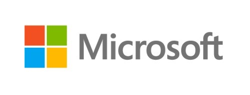

{:class="img-logo"}
{:class="img-logo"}
{:class="img-logo"}
{:class="img-logo"}

We are a [team of researchers and
engineers](https://project-everest.github.io/people/) from several
organizations, including [Microsoft
Research](https://www.microsoft.com/en-us/research/project/project-everest-verified-secure-implementations-https-ecosystem/),
[Carnegie Mellon University](http://www.andrew.cmu.edu/user/bparno/),
[INRIA](http://prosecco.gforge.inria.fr/), and the
[MSR-INRIA](https://www.microsoft.com/en-us/research/collaboration/inria-joint-centre/)
joint center.

# Provably Secure Communication Software

Focusing on the HTTPS ecosystem, including components such as the TLS
protocol and its underlying cryptographic algorithms, Project Everest
began in 2016 aiming to build and deploy formally verified
implementations of several of these components in the [F\* proof
assistant](https://fstar-lang.org).

While we have yet to complete a fully verified implementation of
HTTPS, we have branched out to tackle a broader range of problems,
including verified implementations of newer security protocols like
[QUIC](https://datatracker.ietf.org/doc/draft-ietf-quic-transport/),
[Signal](https://signal.org/) and
[DICE](https://trustedcomputinggroup.org/work-groups/dice-architectures/),
as well as securing networking infrastructure used in commerical cloud
platforms.

Everest software is deployed in systems ranging from the Linux kernel
and the Windows kernel to Microsoft Azure and Mozilla Firefox,
improving the security and reliability of software used by *billions*
of people every day.

## Everest Artifacts with Formal Proofs

The following is a partial list of software components with formal
proofs of correctness and security developed using Project Everest's
toolchain.

### The TLS-1.3 record Layer

The TLS record layer is the main bridge between applications and TLS'
internal sub-protocols. Its core functionality is an elaborate
authenticated encryption: streams of messages for each sub-protocol
(hand- shake, alert, and application data) are fragmented,
multiplexed, and encrypted with optional padding to hide their lengths

We have built and verified a reference implementation of the TLS
record layer and its cryptographic algorithms in F\*, reducing the
high-level security of the record layer to cryptographic assumptions
on its ciphers.

Our implementation has been plugged in to [miTLS](https://mitls.org),
a TLS library partially verified in F\*, and interoperates with Chrome
and Firefox, confirming that our code is compatible with other,
mainstream (unverified) implementations.

See [this paper](https://eprint.iacr.org/2016/1178) and [this
page](https://project-everest.github.io/record/) for more details.

Additionally, the [miTLS] protocol stack powers Microsoft's primary
implementation of the [QUIC transport
protocol](https://datatracker.ietf.org/doc/draft-ietf-quic-transport/).

### HACL*, ValeCrypt, and EverCrypt: Cryptographic libraries

[HACL\*](https://github.com/project-everest/hacl-star) is a formally
verified library of modern cryptographic algorithms, where each
primitive is verified for memory safety, functional correctness, and
secret independence. HACL\* provide efficient, readable, standalone C
code for each algorithm that can be easily integrated into any C
project.

[ValeCrypt](https://github.com/project-everest/hacl-star/tree/master/vale)
provides formally verified high-performance cryptographic code for
selected primitives in _assembly_ language. It relies on the Vale tool
to produce code and proofs in F*. Vale supports multiple platforms and
proves that its implementations are memory safe, functionally correct,
and that timing and memory accesses are secret independent.

[EverCrypt](https://github.com/project-everest/hacl-star/blob/master/providers/evercrypt)
is a high-performance, cross-platform, formally verified modern
cryptographic provider that packages implementations from HACL* and
ValeCrypt, and automatically picks the fastest one available,
depending on processor support and the target execution environment
(multiplexing). Furthermore, EverCrypt offers an (agile) API that
makes it simple to switch between algorithms (e.g., from SHA2 to
SHA3), and verified cryptographic data structures like Merkle trees.

Code from HACL\*, ValeCrypt and EverCrypt is deployed in several
production systems, including [Mozilla
Firefox](https://blog.mozilla.org/security/2017/09/13/verified-cryptography-firefox-57/),
[Azure Confidential Consortium
Framework](https://www.microsoft.com/en-us/research/project/confidential-consortium-framework/),
the [Wireguard](https://www.wireguard.com) VPN, the upcoming [Zinc
crypto library](https://lwn.net/Articles/770750/) for the Linux
kernel, the [MirageOS unikernel](https://mirage.io/), the
[ElectionGuard](https://www.electionguard.vote/) electronic voting
SDK, and in the
[Tezos](https://www.reddit.com/r/tezos/comments/8hrsz2/tezos_switches_cryptographic_libraries_from)
and [Concordium](https://www.concordium.com) blockchains.

### The QUIC record Layer

[QUIC](https://datatracker.ietf.org/doc/draft-ietf-quic-transport/) is
a new, high-performance secure transport protocol. We model packet and
header encryption, which uses a custom construction for privacy and
formalize and verify its security in F\* and integrate it with a
provably-safe implementation of the rest of the QUIC protocol in
[Dafny](https://github.com/dafny-lang/dafny). Our record layer
achieves nearly 2 GB/s throughput, and our QUIC implementation’s
performance is within 21% of an unverified baseline. For more details,
see [this
paper](https://www.microsoft.com/en-us/research/publication/security-model-verified-implementation-quic-record-layer/).

### Signal*: A verified secure messaging protocol

[Signal](https://signal.org/) is a secure messaging application that
relies on a special cryptographic protocol for exchanging messages
between participants. The Signal web application runs inside the
browser using the Web Crypto API and Emscripten-generated Javascript
code for encryption. [Signal\*](https://signalstar.gforge.inria.fr/)
is a reimplementation of the core protocol, verified in F\* and
extracted to [WebAssembly](https://webassembly.org/), a portable
execution environment supported by all major browsers and Web
application frameworks. For more details, see [this
paper](https://www.computer.org/csdl/proceedings-article/sp/2019/666000b002/19skg8v5fZS).

### DICE*: A verified implementation of DICE measured boot

Measured boot is an important class of boot protocols which ensure that
each layer of firmware and software in a device’s chain of trust is
measured, and the measurements are reliably recorded for subsequent
verification.

DICE\* is a formal specification as well as a formally verified
implementation in F\* of
[DICE](https://trustedcomputinggroup.org/work-groups/dice-architectures/),
an industry standard measured boot
protocol. DICE\* has been integrated into the boot firmware of an
STM32H753ZI micro-controller, replacing an unverified DICE implementation
with negligible effect on the code size and boot time. For more details, see [this
paper](https://www.microsoft.com/en-us/research/publication/dice-a-formally-verified-implementation-of-dice-measured-boot/).

## Tools for Program Proofs

In conjunction with our verified software artifacts, we develop a
variety tools for program proofs.

### F*: A programming language and proof assistant

[F\*](https://fstar-lang.org) is a general-purpose functional
programming language with effects, based on dependent type theory and
aimed at program verification. It puts together the automation of an
SMT-backed deductive verification tool with the expressive power of a
proof assistant based on dependent types. After verification, F\*
programs can be extracted to OCaml, F\#, C, Wasm, or ASM code. F\* is
the core programming and proving platform on which Project Everest is
built.

### Vale: A tool for verifying cryptographic primitives in assembly

[Vale](https://github.com/project-everest/vale) is a tool for
constructing formally verified high-performance assembly language
code, with an emphasis on cryptographic code. It uses existing
verification frameworks, including both
[Dafny](https://github.com/dafny-lang/dafny) and
[F*](https://fstar-lang.org), for formal verification. It supports
multiple architectures, such as x86, x64, and ARM, and multiple
platforms, such as Windows, Mac, and Linux. Additional architectures
and platforms can be supported with no changes to the Vale tool.

### Low* and KReMLin: A proof-oriented subset of C embedded in F\*

Low\* is a subset of F\* and a set of F\* libraries that models a
fragment of the C programming language, including its memory model,
stack- and heap-allocated arrays, machine integers, C string literals,
and a few system-level functions from the C standard library, enabling
formal proofs of low-level, sequential, imperative programs in
F\*. Low\* programs are compilable to C by
[KReMLin](https://fstarlang.github.io/lowstar/html/). [This
paper](https://doi.org/10.1145/3110261) provides more details.

### EverParse: A parser generator for binary data formats

[EverParse](https://project-everest.github.io/everparse/) is a
framework for generating formally proven secure parsers and formatters
from domain-specific format specification languages. It produces
optimized C code through the Low\* toolchain which has been integrated
in several projects, including our verified implementations of QUIC,
DICE, and in the Microsoft Azure networking stack.

### Steel: A concurrent separation logic embedded in F\*

[Steel](https://www.microsoft.com/en-us/research/uploads/prod/2021/03/steel.pdf)
is a framework embedded in F\* for programming and proving concurrent
and distributed programs in a new concurrent separation logic called
[SteelCore](https://www.fstar-lang.org/papers/steelcore/).

## Getting started with Project Everest

Project Everest is the combination of the following GitHub
projects.

- [F*], a verification language for effectful programs
- [miTLS], reference implementation of the TLS protocol in [F\*]
- [KreMLin], a compiler from a subset of [F\*] to C
- [HACL*], a verified library of cryptographic primitives written in [F\*], including
  the EverCrypt cryptographic provider.
- [Vale], a domain-specific language for verified cryptographic
  primitives in assembly
- [EverCrypt], a verified crypto provider that combines [HACL\*] and
  [Vale] via an agile, multi-platform, self-configuring cryptographic API.
- [EverParse], a library and tool to automatically generate verified
  parsers and serializers for binary data formats

[F*]: https://github.com/FStarLang/FStar
[miTLS]: https://github.com/project-everest/mitls-fstar
[KreMLin]: https://github.com/FStarLang/kremlin
[HACL*]: https://github.com/project-everest/hacl-star
[Vale]: https://github.com/project-everest/vale
[EverParse]: https://github.com/project-everest/everparse
[EverCrypt]: (https://github.com/project-everest/hacl-star/blob/master/providers/evercrypt)

To make things easier for prospective users, the [everest
script](https://github.com/project-everest/everest) performs high-level project
management and revision tracking.

**Prerequisite** (Windows only). Open up a Cygwin64 terminal with a Cygwin git
client. Our library is a native Windows DLL but we rely on Cygwin to provide the
Unix tools that many of our projects rely on.

The first step checks out the high-level `everest` command.

```
git clone https://github.com/project-everest/everest
cd everest
```

This will ensure that your environment is sane. On Windows, this will fetch &
install a proper version of OCaml and all packages for you.

```
./everest check
```

If you just want to read the sources, then the step below is sufficient; it will
fetch blessed versions of all the projects, which are known to work
together.

```
./everest pull
```

At this stage, you can build HACL\*, ValeCrypt and EverCrypt since the generated
C/ASM is under version control. If that's what you're looking for, head over to
[the relevant documentation](https://hacl-star.github.io/Obtaining.html).

If you'd rather build the tools and verify all of Project Everest, read on.

Building all the projects together should work at any time, and be achieved by
running

```
./everest make
```

Testing the generated binaries can be achieved by running:

```
./everest test
```

Finally, if you want to revert to a clean state, you can run:

```
./everest clean
```

## For the lazy: Docker

Every night, we automatically build the `projecteverest/everest-linux`
Linux Docker image with everything already built and verified, for you
to directly pull from the [Docker
Hub](https://hub.docker.com/r/projecteverest/everest-linux), where you can find the
list of the latest images, each of which is tagged with their commit
hash on the Everest repository and is accompanied with its relevant
`docker pull` command to download and run it on your machine.

Then, for some image with tag `foobar`, you can create and run a fresh
container with a Bash interactive command-line prompt using the
following command:

```
docker run -i -t projecteverest/everest-linux:foobar /bin/bash --login
```

(Windows Docker images are no longer working, due to [this issue](https://github.com/moby/moby/issues/41058).)

## Filing bugs

Please [file bugs](https://github.com/project-everest/everest/issues) if
something doesn't work!
